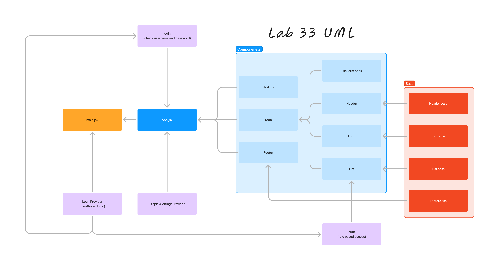
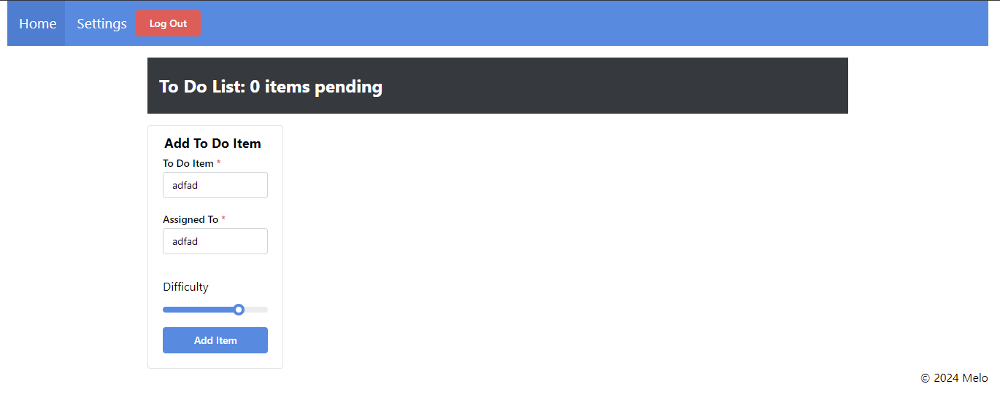
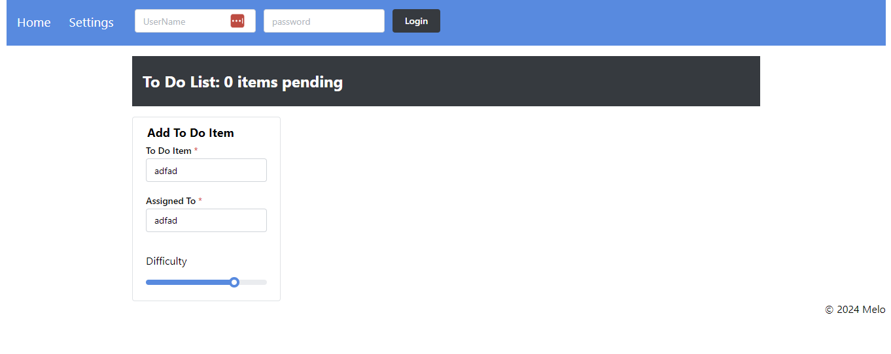

# 401 - Lab 34 - API Integration

## Project: To-Do App

### Author: Melo

### Problem Domain

**To Do List Manager Phase 4:** Require that users be logged in through a live authentication server, in order to see the to do items. Additionally, based on their user type, they will be allowed (or denied) to perform actions such as editing or deleting them. All To Do items will be stored in a database, accessed through a deployed API.

### Feature Tasks & Requirements

In Phase 4, finalize the functionality of the application by connecting to live servers for login, authorization, and data access.

### Technical Requirements/Notes

1. Alter the Add, Toggle Complete, and Delete functions within your to do application to use your API instead of in memory state.

    * Fetch the current list of items from the database on application start.
    * Whenever you add/update/delete an item, refresh the state so the user can instantly see the change.
        * Consider: Do you re-fetch from the server every time you make a change?
            * If so, how?
            * If not, how will you stay in sync?

2. Alter the Login Context to use the server to login users instead of our mock users list.
    * Be sure to store the token in state as well as in a cookie so you can reference it later.

### API Sever

* Need a deployed API Server, which implements a todo item data model.
  * GET /todo: Gets a list of all items.
  * ‘POST /todo’: Adds an item.
  * ‘PUT /todo’: Updates an item (use this to mark them as complete).
  * ‘DELETE /todo/:id’ : Deletes an item.

### Authentication Server

* Authentication Server
  * Need a deployed Authenticated API Server, which supports:
  * Registration (/signup).
  * Login (/signin).
  * Authorization (via Bearer Token).
  * ACL (using user roles).
  * Ensure creatin of user roles and permissions lists that front-end is expecting to tap into.
  * To Do data model for storing the actual to do items.

## Documentation

### Describe how global state is consumed by the components

#### Components Consuming Global State

1. App Component:

    * The App component wraps its children (Todo and Footer) with DisplaySettingsProvider and MantineProvider. This makes the context values available to any nested component.

2. Todo Component:

    * The Todo component does not directly consume the SettingsContext, but it passes the list and functions (toggleComplete, deleteItem) down to the List component, which does consume the context.

3. List Component:

    * The List component uses useContext to access the global state provided by SettingsContext.
    * It uses displayItems to determine how many items to display per page.
    * It uses hideCompleted to filter out completed items if this setting is true.
    * The context values are used within the useEffect hook and rendering logic to dynamically adjust the displayed list of items based on the settings.

### Describe the operation of the hook: useForm()

#### Operation of the useForm Hook

The useForm hook is a custom hook designed to handle form state management and submission logic.

1. State Initialization:

    * const [values, setValues] = useState({});
    * Initializes a state variable values to hold form field values.

2. Handle Form Submission:

    * const handleSubmit = (event) => { ... }
    * Prevents the default form submission behavior using event.preventDefault().
    * Calls the callback function (passed to useForm) with the current form values (values).

3. Handle Form Field Changes:

    * const handleChange = (event) => { ... }
    * Updates the values state based on the form field changes.
    * Determines the name and value of the form field that triggered the event.
    * Handles special cases like sliders (used for difficulty in this case) where the event might not be a standard form event.
    * Updates the state with the new value of the form field.

4. Effect Hook for Initial Values:

    * useEffect(() => { setValues(defaultValues); }, [defaultValues]);
    * Sets the initial values of the form fields when the component mounts.
    * The defaultValues can be passed to the hook to initialize the form fields.

5. Return Values and Functions:

    * The hook returns an object containing handleChange, handleSubmit, and values.
    * These functions and state are used by the component that calls the useForm hook to manage form interactions.

### How to initialize/run application (where applicable)

* npm run dev

### Libraries needed (where applicable)

Install

* "@mantine/carousel": "^7.11.1",
* "@mantine/charts": "^7.11.1",
* "@mantine/code-highlight": "^7.11.1",
* "@mantine/core": "^7.11.1",
* "@mantine/dates": "^7.11.1",
* "@mantine/dropzone": "^7.11.1",
* "@mantine/form": "^7.11.1",
* "@mantine/hooks": "^7.11.1",
* "@mantine/modals": "^7.11.1",
* "@mantine/notifications": "^7.11.1",
* "@mantine/nprogress": "^7.11.1",
* "@mantine/spotlight": "^7.11.1",
* "@mantine/tiptap": "^7.11.1",
* "@tabler/icons-react": "^3.10.0",
* "@tiptap/extension-link": "^2.4.0",
* "@tiptap/react": "^2.4.0",
* "@tiptap/starter-kit": "^2.4.0",
* "dayjs": "^1.11.11",
* "embla-carousel-react": "^8.1.6",
* "jwt-decode": "^4.0.0",
* "react": "^18.3.1",
* "react-cookies": "^0.1.1",
* "react-dom": "^18.3.1",
* "react-if": "^4.1.5",
* "react-router-dom": "^6.24.1",
* "recharts": "^2.12.7",
* "sass": "^1.77.6",
* "uuid": "^10.0.0"

Dev Dependencies

* "@testing-library/jest-dom": "^6.4.6",
* "@testing-library/react": "^16.0.0",
* "@testing-library/user-event": "^14.5.2",
* "@types/react": "^18.3.3",
* "@types/react-dom": "^18.3.0",
* "@vitejs/plugin-react": "^4.3.1",
* "eslint": "^8.57.0",
* "eslint-plugin-react": "^7.34.2",
* "eslint-plugin-react-hooks": "^4.6.2",
* "eslint-plugin-react-refresh": "^0.4.7",
* "jest": "^29.7.0",
* "jsdom": "^24.1.0",
* "postcss": "^8.4.39",
* "postcss-preset-mantine": "^1.15.0",
* "postcss-simple-vars": "^7.0.1",
* "vite": "^5.3.1",
* "vitest": "^2.0.2"

### React + Vite

This template provides a minimal setup to get React working in Vite with HMR and some ESLint rules.

Currently, two official plugins are available:

* [@vitejs/plugin-react](https://github.com/vitejs/vite-plugin-react/blob/main/packages/plugin-react/README.md) uses [Babel](https://babeljs.io/) for Fast Refresh
* [@vitejs/plugin-react-swc](https://github.com/vitejs/vite-plugin-react-swc) uses [SWC](https://swc.rs/) for Fast Refresh

### Testing

* App.jsx testing to assert adding, deleting, and completing items
* Settings.jsx testing to assert context consumed by child components.
* auth.jsx test to assert RBAC
* login.jsx test to assert login and logout
* context.jsx test to assert context consumption

### Link to Pull Request ---> [Pull Request](https://github.com/MelodicXP/todo-app/pull/7)
