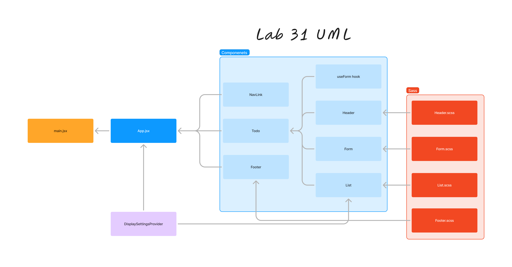
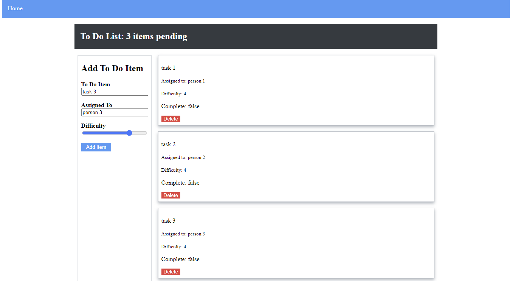

# 401 - Lab 31 - Context API

## Project: To-Do App

### Author: Melo

### Problem Domain

Phase 2: Incorporate configuration settings to the application. Extend the functionality of application by allowing user to make some decisions on how they would like application to function. Specifically, allow user to make changes to '2' settings.

### Feature Tasks & Requirements

* Implement the Context API to make some basic application settings available to components
  * How many To Do Items to show at once.
  * Whether or not to show completed items.
  * Hint: if reusing the custom useForm() hook, event validation may be necessary if using any Mantine component other than \<TextInput />
  
* Provide the users with a form where they can change the values for those settings.
  * This should be given in the form of a new component, perhaps linked to from the main navigation.
  * Hint: Use Browser Router to create the page/route/component for this.
  * Once settings are updated, render the updated settings to the right of the “form”. Consider using \<Grid />, \<Card />, and \<When /> components.

* Save the users choices in Local Storage.

* Retrieve their preferences from Local Storage and apply them to the application on startup.

### Technical Requirements/Notes

1. Extend context provider to include all of the following features:

    * Create a context for managing application settings and provide this at the application level.
    * Display or Hide completed items (boolean)
    * Number of items to display per screen (number).
    * Create a function in context that saves user preferences (for the above) to local storage.
    * Default sort field (string).
    * Implement a useEffect() (or componentDidMount()) in context to read from local storage and set the values for those 2 state properties on application load.  

    Note: Need to stringify() state prior to saving to local storage, and parse it when retrieve it.

2. Consume and utilize context values throughout components.

    * Show a maximum of three items per screen by default in the \<List /> component.
        * Properly implement the Mantine \<Pagination /> component functionality to let the users navigate a long list of items with the correct number of tasks showing per “page”.

    * Hide completed items in the list

## Documentation

### Describe how global state is consumed by the components

#### Components Consuming Global State

1. App Component:

    * The App component wraps its children (Todo and Footer) with DisplaySettingsProvider and MantineProvider. This makes the context values available to any nested component.

2. Todo Component:

    * The Todo component does not directly consume the SettingsContext, but it passes the list and functions (toggleComplete, deleteItem) down to the List component, which does consume the context.

3. List Component:

    * The List component uses useContext to access the global state provided by SettingsContext.
    * It uses displayItems to determine how many items to display per page.
    * It uses hideCompleted to filter out completed items if this setting is true.
    * The context values are used within the useEffect hook and rendering logic to dynamically adjust the displayed list of items based on the settings.

### Describe the operation of the hook: useForm()

#### Operation of the useForm Hook

The useForm hook is a custom hook designed to handle form state management and submission logic.

1. State Initialization:

    * const [values, setValues] = useState({});
    * Initializes a state variable values to hold form field values.

2. Handle Form Submission:

    * const handleSubmit = (event) => { ... }
    * Prevents the default form submission behavior using event.preventDefault().
    * Calls the callback function (passed to useForm) with the current form values (values).

3. Handle Form Field Changes:

    * const handleChange = (event) => { ... }
    * Updates the values state based on the form field changes.
    * Determines the name and value of the form field that triggered the event.
    * Handles special cases like sliders (used for difficulty in this case) where the event might not be a standard form event.
    * Updates the state with the new value of the form field.

4. Effect Hook for Initial Values:

    * useEffect(() => { setValues(defaultValues); }, [defaultValues]);
    * Sets the initial values of the form fields when the component mounts.
    * The defaultValues can be passed to the hook to initialize the form fields.

5. Return Values and Functions:

    * The hook returns an object containing handleChange, handleSubmit, and values.
    * These functions and state are used by the component that calls the useForm hook to manage form interactions.

### How to initialize/run application (where applicable)

* npm run dev

### Libraries needed (where applicable)

Install

* "@mantine/core": "^7.11.1",
* "@mantine/hooks": "^7.11.1",
* "@tabler/icons-react": "^3.10.0",
* "react": "^18.3.1",
* "react-dom": "^18.3.1",
* "sass": "^1.77.6",
* "uuid": "^10.0.0"

Dev Dependencies

* "@types/react": "^18.3.3",
* "@types/react-dom": "^18.3.0",
* "@vitejs/plugin-react": "^4.3.1",
* "eslint": "^8.57.0",
* "eslint-plugin-react": "^7.34.2",
* "eslint-plugin-react-hooks": "^4.6.2",
* "eslint-plugin-react-refresh": "^0.4.7",
* "vite": "^5.3.1"

### React + Vite

This template provides a minimal setup to get React working in Vite with HMR and some ESLint rules.

Currently, two official plugins are available:

* [@vitejs/plugin-react](https://github.com/vitejs/vite-plugin-react/blob/main/packages/plugin-react/README.md) uses [Babel](https://babeljs.io/) for Fast Refresh
* [@vitejs/plugin-react-swc](https://github.com/vitejs/vite-plugin-react-swc) uses [SWC](https://swc.rs/) for Fast Refresh

### Testing

* App.jsx testing to assert adding, deleting, and completing items
* Settings.jsx testing to assert context consumed by child components.

### Link to Pull Request ---> [Pull Request](https://github.com/MelodicXP/todo-app/pull/2)
